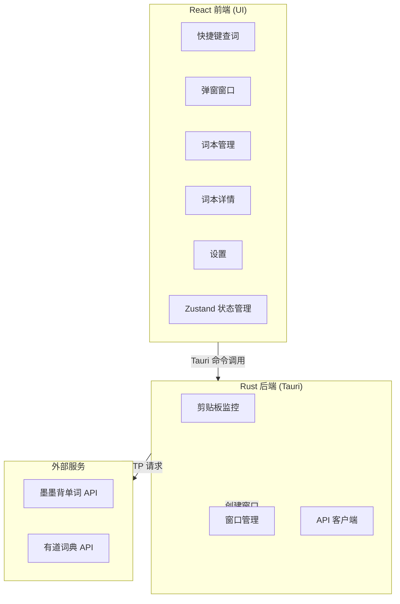

# 墨墨单词助手 - 设计文档

## 项目概述

墨墨单词助手是一个使用 Tauri 2 + React + Rust 开发的 Windows 桌面应用，用于英语单词查词，并添加到墨墨背单词云词本。

## 设计目标

> **让用户在"看到不认识的单词 → 采集进词本"这件事上，尽量少分心、少跳转、少操作。**

### 核心设计原则

1. **轻量** - 高频使用的小工具，界面不复杂，层级不多，功能入口不堆砌
2. **快速** - 弹窗界面聚焦，快速看一眼、快速加入词本、快速关闭
3. **安静** - 配色、字体、阴影、按钮偏克制，气质像"桌面上的学习助手"
4. **可扩展** - UI 结构支持后续增加例句、词根词缀、AI 释义、复习记录等功能

## 技术栈

| 层级 | 技术 |
|------|------|
| 前端 | React 19, TypeScript, Vite 7 |
| UI | Tailwind CSS 4 |
| 状态管理 | Zustand |
| 桌面框架 | Tauri 2.0 |
| 后端 | Rust |
| API | 墨墨背单词开放 API、有道词典 API |

## 产品结构：两类窗口

### 1. 划词弹窗（独立 Tauri 窗口）

**定位**：用户触发快捷键后弹出的独立窗口，显示在鼠标光标位置

**实现**：通过 Tauri `WebviewWindowBuilder` 创建独立窗口，无边框、置顶、不显示在任务栏

**负责的事**：
- 展示当前单词和音标
- 展示有道词典释义
- 提供"加入学习"按钮
- 提供"添加到词本"按钮（可选词本）
- 点击窗口外部或按 Escape 自动关闭

**不负责的事**：
- 大量例句
- 复杂词源分析
- 历史记录浏览
- 词本管理
- 设置项配置

### 2. 主窗口（词本管理和应用设置中心）

**定位**：用户主动打开应用时看到的完整界面

**负责的事**：
- 查看词本列表和词本详情
- 管理词本（创建、编辑、删除）
- 查看单词释义、助记、例句
- 将单词加入学习或词本
- 配置快捷键和墨墨账号授权

**不负责的事**：
- 替代弹窗完成快速加词
- 做沉浸式阅读器
- 承担复杂学习系统

## 架构设计

### 整体架构



### 数据流

#### 划词查词流程

1. 用户按快捷键（默认 `Ctrl+Shift+A`）
2. 前端读取剪贴板内容，验证是否为英文单词
3. 并行请求墨墨 API（获取 `voc_id`）和有道词典 API（获取释义）
4. Rust 后端创建独立弹窗窗口，位于鼠标光标位置
5. 通过 URL 参数传递单词数据给弹窗
6. 弹窗显示单词、音标、释义
7. 用户可点击"加入学习"或"添加到词本"

#### 词本管理流程

1. 前端请求词本列表（自动分页遍历）
2. Rust 后端调用墨墨 API `GET /notepads?limit=10&offset=N`
3. 返回词本数据 → 前端渲染词本卡片
4. 用户点击词本 → 获取词本详情
5. 展示词本中的单词列表，支持查看释义

#### 添加单词到词本流程

1. 获取词本当前 `content`
2. 查询每个 `voc_id` 对应的单词拼写
3. 将新单词追加到 `content`（自动去重）
4. 调用 `POST /notepads/{id}` 更新词本

### 状态管理

使用 Zustand 进行全局状态管理，分为三个 store：

| Store | 用途 | 主要状态 |
|-------|------|----------|
| wordStore | 单词相关 | currentWord, recentWords |
| notepadStore | 词本管理 | notepads, selectedNotepad, isLoading |
| settingsStore | 用户设置 | maimemoToken, hotkey, selectedNotepadId |

## API 集成

### 墨墨背单词 API

- **Base URL**: `https://open.maimemo.com/open`
- **认证方式**: Bearer Token
- **请求频率限制**: 20次/10秒, 40次/60秒, 2000次/5小时

#### 主要端点

| 功能 | 方法 | 端点 |
|------|------|------|
| 查询单词 | GET | `/api/v1/vocabulary?spelling=word` |
| 批量查询词汇 | POST | `/api/v1/vocabulary/query` |
| 获取词本列表 | GET | `/api/v1/notepads?limit=10&offset=0` |
| 获取词本详情 | GET | `/api/v1/notepads/{id}` |
| 创建词本 | POST | `/api/v1/notepads` |
| 更新词本 | POST | `/api/v1/notepads/{id}` |
| 删除词本 | DELETE | `/api/v1/notepads/{id}` |
| 获取释义 | GET | `/api/v1/interpretations?voc_id={id}` |
| 获取助记 | GET | `/api/v1/notes?voc_id={id}` |
| 获取例句 | GET | `/api/v1/phrases?voc_id={id}` |
| 加入学习 | POST | `/api/v1/study/add_words` |

> **注意**: 词本列表 `limit` 最大为 10，需分页遍历获取全部词本。

### 有道词典 API

- **无需 API Key**
- **端点**: `GET https://dict.youdao.com/jsonapi?q={word}`
- **返回**: 音标、释义、例句、词形变化

## 项目结构

```
mo-mo-selector/
├── src/                        # React 前端
│   ├── components/
│   │   ├── WordLookup.tsx      # 快捷键查词 + 词本选择弹窗
│   │   ├── PopupWindow.tsx     # 独立弹窗窗口组件
│   │   ├── NotepadManager.tsx  # 词本管理（列表、创建、编辑、删除）
│   │   ├── NotepadViewer.tsx   # 词本详情（单词列表 + 释义查看）
│   │   ├── Settings.tsx        # 设置页面
│   │   └── Toast.tsx           # 全局提示
│   ├── stores/
│   │   ├── wordStore.ts
│   │   ├── notepadStore.ts
│   │   ├── settingsStore.ts
│   │   └── toastStore.ts
│   ├── lib/
│   │   └── tauri.ts            # Tauri 命令封装
│   ├── main.tsx                # 入口，hash 路由区分主窗口/弹窗
│   └── App.tsx
├── src-tauri/                  # Rust 后端
│   └── src/
│       └── lib.rs              # Tauri 命令定义（17 个命令）
├── docs/                       # 文档
│   ├── API.md                  # API 文档
│   ├── DESIGN.md               # 设计文档
│   ├── UI.md                   # UI 设计规范
│   ├── PROGRESS.md             # 实现进度
│   └── CHANGELOG.md            # 更新记录
└── package.json
```

## 安全考虑

- API 密钥存储在本地，不上传到任何服务器
- 使用 HTTPS 进行 API 通信
- 前端不直接调用外部 API，通过 Rust 后端代理
