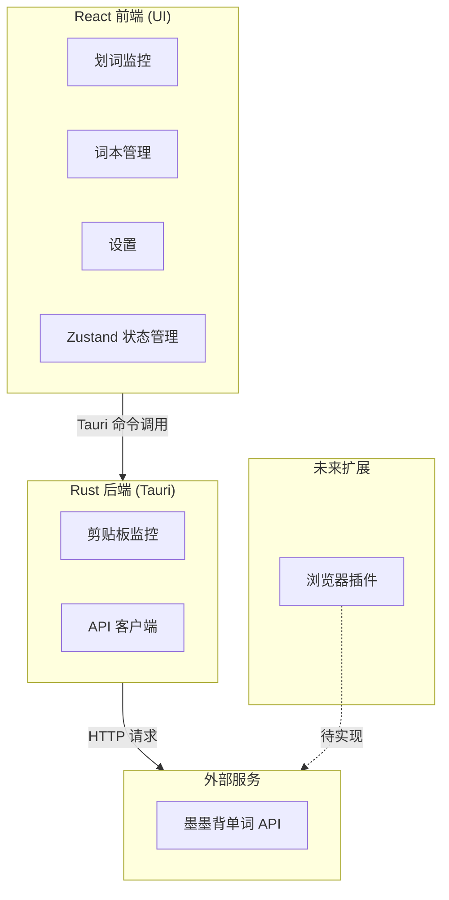
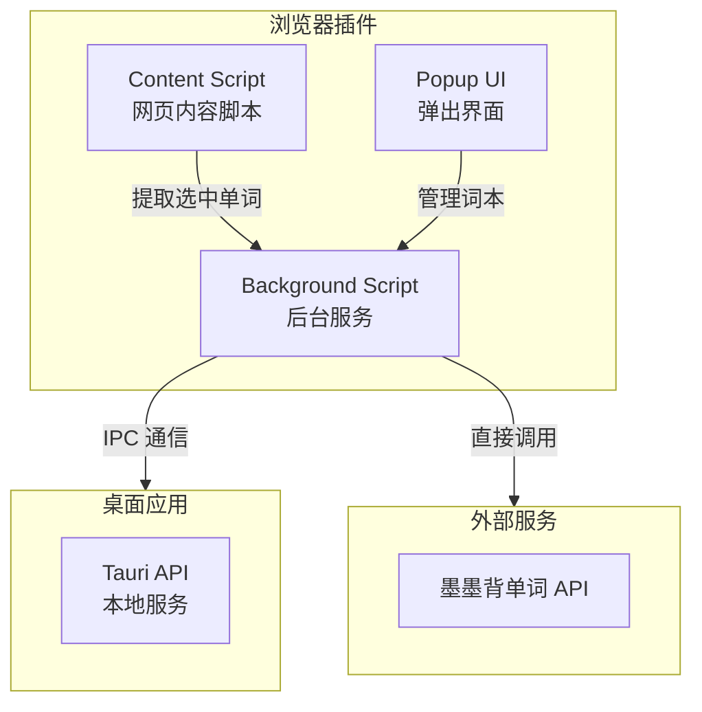

# 墨墨单词助手 - 设计文档

## 项目概述

墨墨单词助手是一个使用 Tauri + React 开发的 Windows 桌面应用，用于英语单词划词，并添加到墨墨背单词云词本。

## 设计目标

> **让用户在"看到不认识的单词 → 采集进词本"这件事上，尽量少分心、少跳转、少操作。**

### 核心设计原则

1. **轻量** - 高频使用的小工具，界面不复杂，层级不多，功能入口不堆砌
2. **快速** - 弹窗界面聚焦，快速看一眼、快速加入词本、快速关闭
3. **安静** - 配色、字体、阴影、按钮偏克制，气质像"桌面上的学习助手"
4. **可扩展** - UI 结构支持后续增加例句、词根词缀、AI 释义、复习记录等功能

## 技术栈

| 层级 | 技术 |
|------|------|
| 前端 | React 19, TypeScript, Vite 7 |
| UI | Tailwind CSS 4 |
| 状态管理 | Zustand |
| 桌面框架 | Tauri 2.0 |
| 后端 | Rust |
| API | 墨墨背单词开放 API |

## 产品结构：两类窗口

### 1. 划词浮窗（即时操作面板）

**定位**：用户划词或触发快捷键后弹出的小卡片

**负责的事**：
- 展示当前单词
- 展示音标和简短释义
- 提供发音按钮
- 提供"加入墨墨词本"按钮
- 告知用户是否已加入、是否同步成功

**不负责的事**：
- 大量例句
- 复杂词源分析
- 历史记录浏览
- 词本管理
- 设置项配置

### 2. 主窗口（词本管理和应用设置中心）

**定位**：用户主动打开应用时看到的完整界面

**负责的事**：
- 查看今天新增了哪些单词
- 查看历史词本
- 搜索和删除单词
- 查看同步状态
- 配置快捷键和墨墨账号授权

**不负责的事**：
- 替代浮窗完成快速加词
- 做沉浸式阅读器
- 承担复杂学习系统

## 信息架构：主窗口一级页面

MVP 阶段主窗口保留四个一级页面：

### 1. 今日新增（默认首页）

**作用**：
- 让用户快速确认今天的采词成果
- 告诉用户有多少单词已经同步成功
- 告诉用户是否有同步失败的词需要处理

**核心信息**：
- 今日新增总数
- 已同步数量
- 待同步数量
- 今日新增单词列表

### 2. 我的词本

**作用**：
- 作为"总词库"
- 提供搜索、筛选、排序能力
- 承担后续可能扩展的"按时间/状态/来源查看词汇"的能力

### 3. 同步记录

**作用**：
- 告诉用户最近的同步行为是否成功
- 告诉用户失败的原因
- 帮助排查墨墨 token 失效、网络失败、词条不存在等问题

### 4. 设置

**作用**：所有配置项集中管理

**至少包含**：
- 墨墨账号连接状态
- 快捷键设置
- 是否自动读取剪贴板
- 是否自动播放发音
- 是否添加后自动关闭浮窗

## 架构设计

### 整体架构



### 数据流

#### 划词流程

1. 用户复制单词 → 剪贴板监控检测到变化
2. Rust 后端读取剪贴板内容
3. 验证是否为英文单词（正则匹配 `/^[a-zA-Z]+$/`）
4. 调用墨墨 API 验证单词是否在词库中
5. 返回结果给前端 → 显示确认对话框
6. 用户确认后添加到选中的词本

#### 词本管理流程

1. 前端请求词本列表
2. Rust 后端调用墨墨 API `GET /notepads`
3. 返回词本数据 → 前端渲染词本卡片
4. 用户选择词本 → 前端发送请求
5. Rust 后端调用墨墨 API `POST /notepads/{id}/words`

### 浏览器插件架构（后期实现）

浏览器插件作为桌面应用的补充，用于在浏览器中直接划词添加到词本。



**实现方案：**

| 方案 | 说明 | 优缺点 |
|------|------|--------|
| 方案A：独立插件 | 插件直接调用墨墨 API | 简单，但需要单独管理 API 密钥 |
| 方案B：与桌面应用通信 | 插件通过 WebSocket/IPC 与桌面应用通信 | 统一管理，但依赖桌面应用运行 |

**推荐：方案A（独立插件）** - 插件独立运行，用户在插件设置中配置 API 密钥。

**插件功能：**
- 右键菜单：选中单词 → 添加到指定词本
- 弹出界面：查看最近添加、切换词本
- 设置页面：配置 API 密钥、默认词本

### 状态管理

使用 Zustand 进行全局状态管理，分为三个 store：

| Store | 用途 | 主要状态 |
|-------|------|----------|
| wordStore | 单词相关 | currentWord, recentWords |
| notepadStore | 词本管理 | notepads, selectedNotepad, isLoading |
| settingsStore | 用户设置 | maimemoToken, hotkey |

## 主窗口布局设计

### 布局结构

采用**左侧导航 + 右侧内容区**的结构。

### 左侧导航栏

#### 1. 应用标识区（最上方）
- 应用名称
- 一句很短的产品描述（可选）
- 作用：建立产品识别，给整个界面一个稳定的视觉起点

#### 2. 导航菜单区（中间）
菜单项只有四个：
- 今日新增
- 我的词本
- 同步记录
- 设置

**视觉层级**：当前选中菜单项通过更深的背景、更高的文字权重、左侧小色条或图标强调

#### 3. 状态摘要区（底部）
- 墨墨账号是否已连接
- 最近一次同步时间
- 当前待同步词数（如果有）

#### 4. 窗口级操作区（可选，MVP 可不做）
- 最小化到托盘
- 检查更新
- 反馈问题

### 右侧内容区顶部栏

包含三部分：
1. **当前页面标题**
2. **页面说明**（可选）：标题下方放一行很短的说明
3. **页面级操作按钮**：不同页面放不同操作

## 页面详细设计

### 页面一：今日新增

#### 概览区（页面顶部）
由三到四个小卡片组成：

| 指标 | 说明 |
|------|------|
| 今日新增 | 今天一共新增了多少个单词 |
| 已同步 | 今天新增词中已经成功同步到墨墨的数量 |
| 待同步 | 还没同步的数量 |
| 同步失败（可选） | 失败数量，如果不为零，用户就知道后台还有队列 |

#### 今日单词列表区（概览区下方）

**每条记录包含**：
- 单词本体（最突出）
- 音标
- 简短释义（一行或两行）
- 添加时间
- 同步状态（已同步/待同步/同步失败）
- 行内操作（可选）：更多按钮，放重新同步、删除、复制单词

**交互重点**：
- 当天没有新增词时显示空状态提示
- 失败词的状态要比普通词更醒目

### 页面二：我的词本

#### 工具栏（列表上方）

| 功能 | 说明 |
|------|------|
| 搜索框 | 按单词拼写搜索，放在最显眼的位置 |
| 状态筛选 | 全部/已同步/待同步/同步失败 |
| 排序方式 | 按添加时间、字母顺序、最近同步时间（MVP 至少保留按时间排序） |
| 批量操作（后续扩展） | MVP 可以不做 |

#### 词本列表

**每条词汇项包含**：
- 单词本体（视觉第一优先级）
- 音标
- 词性和简短释义
- 添加时间
- 同步状态
- 操作区：删除、重新同步、查看详情（后续可加）

**设计原则**：
- 搜索必须容易找到
- 状态不要藏太深，在列表层就能看出来
- 不要在列表里放太多二级信息（词源、例句、难度等级等）

### 页面三：同步记录

#### 同步状态概览（页面顶部）

回答三个问题：
- 最近一次同步是什么时候
- 最近同步成功了多少条
- 最近同步失败了多少条

#### 日志列表（页面主体）

**每条日志包含**：
- 时间
- 单词
- 结果状态（已同步/重复已跳过/失败）
- 原因说明（网络连接失败、墨墨 token 已失效、未找到对应词条、请求频率过高）

**核心目标**：回答哪些词失败了、为什么失败、要不要手动处理

### 页面四：设置

按"模块"分组：

#### 模块一：账号与同步
- 墨墨账号连接状态（已连接/未连接、当前绑定账号、token 是否有效）
- 授权与重新连接入口
- 连接测试

#### 模块二：划词行为
- 快捷键设置
- 是否自动读取剪贴板
- 添加后是否自动关闭浮窗
- 是否自动播放发音

#### 模块三：界面与交互
- 浮窗大小或显示方式（紧凑模式/标准模式）
- 浮窗位置偏好（可选）
- 主题设置（可选）

## 划词浮窗设计

### 总体定位

划词浮窗是一个**瞬时决策面板**，用户打开它是为了完成一个非常短的任务：确认这个词是什么，然后决定要不要加到词本里。

**原则**：信息足够做决定，但不要多到影响决定速度。

### 内部结构（四个区域）

#### 1. 顶部信息区
- 单词本体（整个浮窗最醒目的内容，字号最大、权重最高、位置最靠上）
- 音标（放在单词下方或右侧）
- 关闭按钮（位置固定，不能藏）
- 来源信息（可选，MVP 可以不显示）

#### 2. 释义区
- 1 到 3 条核心释义（优先展示最常见的词义）
- 词性信息（v. / n. / adj.）
- 必要时的简短备注（MVP 不必强求）

#### 3. 操作区
- **第一优先级**：加入词本（最显眼的按钮）
- **第二优先级**：发音（次级按钮）
- **第三优先级**：更多操作（可选，收纳到"更多"菜单里）

#### 4. 状态反馈区
- 已加入本地词本
- 已同步到墨墨
- 已存在，无需重复添加
- 同步失败，稍后重试

### 交互逻辑

1. 用户触发划词
2. 浮窗弹出
3. 用户看到单词和释义
4. 点击加入词本
5. 状态立即反馈
6. 根据设置决定自动关闭还是保留

**关键**：第 4 步到第 5 步之间的反馈速度，即使实际同步是异步的，界面也要先给用户明确状态（如"已加入本地，正在同步"）

## API 集成

### 墨墨背单词 API

- **Base URL**: `https://open.maimemo.com/open/api/v1`
- **认证方式**: Bearer Token
- **请求频率限制**: 20次/10秒, 40次/60秒, 2000次/5小时

#### 主要端点

| 功能 | 方法 | 端点 |
|------|------|------|
| 查询单词 | GET | `/vocabulary?spelling=word` |
| 获取词本列表 | GET | `/notepads` |
| 创建词本 | POST | `/notepads` |
| 添加单词到词本 | POST | `/notepads/{id}/words` |
| 删除词本 | DELETE | `/notepads/{id}` |

## 项目结构

```
mo-mo-selector/
├── src/                    # React 前端
│   ├── components/        # UI 组件
│   │   ├── Monitor.tsx    # 划词监控
│   │   ├── NotepadManager.tsx  # 词本管理
│   │   └── Settings.tsx   # 设置
│   ├── stores/            # 状态管理
│   │   ├── wordStore.ts
│   │   ├── notepadStore.ts
│   │   └── settingsStore.ts
│   ├── lib/               # 工具函数
│   │   └── tauri.ts       # Tauri 命令封装
│   ├── App.tsx
│   └── App.css
├── src-tauri/             # Rust 后端
│   └── src/
│       ├── lib.rs         # Tauri 命令定义
│       └── main.rs        # 入口
├── docs/                  # 文档
├── tailwind.config.js
├── postcss.config.js
└── package.json
```

## 视觉规范

详见 [UI 设计规范](./UI.md)。

### 视觉要点

- **配色**：墨绿 `#2D5A3D` 为主色，配合浅绿 `#4A7C5C` 和中性色
- **字体**：推荐使用衬线字体，提升阅读舒适度和专业感
- **圆角**：中圆角设计，浮窗外层容器 `16px`，卡片 `12px`，按钮 `8px`
- **阴影**：浮窗阴影稍强，主窗口卡片阴影很轻

## 安全考虑

- API 密钥存储在本地，不上传到任何服务器
- 使用 HTTPS 进行 API 通信
- 前端不直接调用外部 API，通过 Rust 后端代理